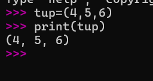
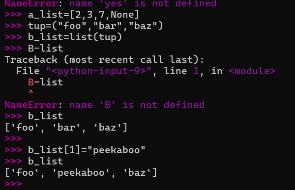

# Python 2주차 정규 과제 

📌Python 정규과제는 매주 정해진 분량의 『*파이썬 라이브러리를 활용한 데이터 분석*』 을 읽고 학습하는 것입니다. 이번주는 아래의 **Python_2nd_TIL**에 나열된 분량을 읽고 공부하시면 됩니다.

아래의 문제를 풀어보며 학습 내용을 점검하세요. 문제를 해결하는 과정에서 개념을 스스로 정리하고, 필요한 경우 참고 자료를 통해 보완하는 것이 좋습니다.

**교재 실습 예제 파일은 07_Python_Template 레포지토리의 notebooks 폴더에 업로드되어 있습니다.**

**👀(수행 인증샷은 필수입니다.)** 

## Python_2nd_TIL

### 3장 내장 자료구조, 함수, 파일
#### 1. 자료구조와 순차 자료형
#### 2. 함수
#### 3. 파일과 운영체제
#### 4. 마치며


## Study Schedule

| 주차  | 공부 범위     | 완료 여부 |
| ----- | ------------- | --------- |
| 1주차 | p.25~82    | ✅         |
| 2주차 | p.83~129   | ✅         |
| 3주차 | p.131~179  | 🍽️         |
| 4주차 | p.181~246 | 🍽️         |
| 5주차 | p.247~309 | 🍽️         |
| 6주차 | p.310~379 | 🍽️         |
| 7주차 | p.381~465 | 🍽️         |


<br>

<!-- 여기까진 그대로 둬 주세요-->

---

# 1️⃣ 학습 내용 정리

## 1. 자료구조와 순차 자료형

### 개념정리

3.1.1.튜플
튜플은 한번 할당되면 변경할 수 없는 고정 길이를 갖는 파이썬의 순차 자료형. 가장 쉬운 생성 방법= 쉼표로 구분되는 일련의 값을 괄호로 감싸기 
만약 튜플같은 표현의 변수에 튜플 대입 시 파이썬은 등호 오른쪽에 있는 변수에서 값을 분리함 
3.1.2 리스트 
튜플과 대조적으로 리스트는 크기, 내용 변경 가능 
list 함수는 이터레이터나 제너레이터 표현에서 실젯값을 모두 담기 위함 

### 실습 인증

<!-- 예제 실습을 진행한 후, 실행 화면을 4-5장 캡쳐하여 제출해주세요. -->




## 2. 함수

### 개념정리

<!-- 이 부분을 지우고 새롭게 배우게 된 내용을 정리해주세요. -->

### 실습 인증

<!-- 예제 실습을 진행한 후, 실행 화면을 4-5장 캡쳐하여 제출해주세요. -->

<!-- 이 부분을 지우고 실행 화면을 제출해주세요. -->


## 3. 파일과 운영체제

### 개념정리

<!-- 이 부분을 지우고 새롭게 배우게 된 내용을 정리해주세요. -->

### 실습 인증

<!-- 예제 실습을 진행한 후, 실행 화면을 4-5장 캡쳐하여 제출해주세요. -->

<!-- 이 부분을 지우고 실행 화면을 제출해주세요. -->


# 2️⃣ 실습 과제

각 문제에 대한 실행 결과가 확인되도록 코드를 작성하고 실행한 뒤, **모든 문제의 실행 화면을 캡처하여 제출하시기 바랍니다.**

**1. 다음 형식으로 학생 정보를 저장하세요.**
```python
students = [
    {"name": "규서", "score": 85},
    {"name": "예운", "score": 72},
    {"name": "민서", "score": 90}
]
```

**2. 문제**
```
1. 전체 평균 점수를 구하는 함수 작성 및 결과 출력
  - students 리스트를 입력받아 평균 점수를 반환하는 get_average 함수를 작성하세요.
  - 함수를 호출하여 계산된 평균 점수를 print()를 이용해 화면에 출력하세요.

2. 80점 이상 우수 학생 추출 및 리스트 출력
  - 리스트 표기법을 사용하여 점수가 80점 이상인 학생의 이름만 담긴 새로운 리스트를 만드세요.
  - 생성된 우수 학생 명단 리스트를 print()를 이용해 화면에 출력하세요.
```

<!-- 이 부분을 지우고 인증 사진을 제출해주세요.-->


### 🎉 수고하셨습니다.


